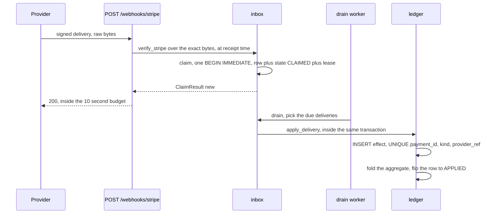
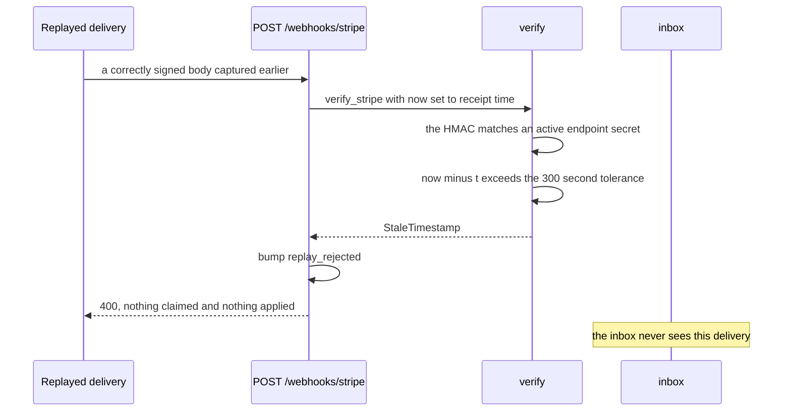

# QUIDZ

**A delivery that arrives twice, out of order, or never must not move money twice. This is the
ledger that makes sure of it, and the reconciliation that proves it afterwards.**

Reading only one thing? Start at [`src/quidz/reconcile.py`](src/quidz/reconcile.py), where the
three way comparison between the stream, the ledger and the settlement report happens.


Seven deliberate breaks in one delivery stream: an amount mismatch, a drop, a duplicate, a
reorder, a replay, a tampered signature and an event shape the parser has never seen. The
frame paces that output; it did not write it. A test rebuilds the ledger from empty, replays
the same stream and diffs what comes back, which is the only way a page like this stays true
after the code moves. Reconciliation and all, at
[pnx89.github.io/QUIDZ](https://pnx89.github.io/QUIDZ/).

[](https://github.com/PNX89/QUIDZ/actions/workflows/ci.yml)
[](https://github.com/PNX89/QUIDZ)
[](LICENSE)

Payment webhook reconciliation with a fail-closed gate on outbound money movement. QUIDZ
(quid, money, slang) verifies signed webhook deliveries from a synthetic provider, applies
them to an idempotent ledger, and reports the drift between the event stream, that ledger and
a settlement report.

Framework-free core, standard library only, no network in any code path or test.

**One module is allowed to import a web framework, and an AST scan over every file enforces
that rather than this sentence.** `quidz.app` is the FastAPI adapter; the ledger, the verifier
and the reconciler all work with FastAPI uninstalled. It takes its signing secrets as arguments
and reads no ambient configuration, so binding it is explicit and an unsigned delivery is
refused at the door rather than parsed first:

```bash
uv run python -c "import uvicorn, quidz.app as a; uvicorn.run(a.create_app(db_path='/tmp/quidz-adapter.db', secrets=[b'whsec_demo'], adyen_hmac_key_hex='00'*32), port=8000)"

curl -sS -X POST localhost:8000/webhooks/stripe -d '{"id":"evt_1"}'
{"error":"missing Stripe-Signature header"}
```

`quidz demo --http` drives that same adapter in process over an ASGI transport with no socket
bound, which is what CI runs: a bound server in a test is a readiness race and a port collision
waiting to happen, and this repository argues against exactly that class of flakiness.

QUESTZ in the same toolset also ends in a fail-closed gate behind a jittered retry, and argues
something different with it: there is no ledger behind a browser check, so repetition there is
never intrinsically safe and the question is how to give up cleanly. Here the ledger is what
makes a re-delivery a no-op, and the retry is a corollary of that rather than the idea.

## The outage this is built around

A webhook handler I inherited treated every processing failure as transient: no permanent
against transient classification, no attempt cap, no jitter, no dead-letter queue, and a
requeue that was immediate. Then one malformed event class arrived, a payload shape the parser
had never seen, and it could not ever succeed. Each attempt failed identically, each failure
scheduled the next, and the poisoned messages crowded the healthy traffic out of the queue. By
the time anyone read the graph the attempt counter was into the billions.

Nothing was lost, which is the only good part of the story. The fix was three unclever things:
classify every failure as permanent or transient before deciding anything, bound the retry with
exponential backoff plus full jitter plus a global budget, and give the permanent failures a
dead-letter queue where a human sees them. A payment system's job is to be boringly, provably
correct, and almost all of that work is defensive.

## Quickstart

```bash
git clone https://github.com/PNX89/QUIDZ.git
cd QUIDZ
uv sync --all-extras --dev
uv run quidz demo --scenario adversarial --db /tmp/quidz-demo/quidz.db
```

Under a minute from clone to output. Nothing to configure, no key to supply, no network call.
Without `--db` the demo writes to a fresh temporary directory, which is the default so that
repeated runs never accumulate state; the Quickstart names a path so that its output is the
block below down to the last line.

## What the demo prints

Real output from the Quickstart command above. `tests/test_docs.py` re-runs the demo and diffs
this block against what it printed, every line of it, so the block cannot drift from the code:

```
QUIDZ demo
  scenario      adversarial
  seed          0
  breaks        amount-mismatch, drop, duplicate, reorder, replay, tamper, unmodelled
  transport     in-process, no socket
  database      /tmp/quidz-demo/quidz.db
  delivery log  /tmp/quidz-demo/quidz.db.jsonl

RECEIPT
  deliveries    17
  accepted      14   duplicate 0   in_progress 1
  rejected      2   (signature 1, replay 1)

DRAIN
  applied 11   noop_duplicate 1   parked 2   dead_lettered 1   retried 2

LEDGER
  PAYMENT                     AUTHORIZED        CAPTURED        REFUNDED  STATUS
  order-YBMEWG9S               45.50 EUR        0.00 EUR        0.00 EUR  capture_failed
  order:MB9WJKNY              196.00 GBP      196.00 GBP      196.00 GBP  refunded
  pi_C29cZ86wXAsjLR2X          33.50 USD       22.11 USD        7.29 USD  partially_refunded
  pi_PCSkRc69KhZqGkJV         128.50 EUR      128.50 EUR        0.00 EUR  captured
  pi_W7bXVRVMG8MCWwSh           5300 JPY           0 JPY           0 JPY  authorized

EXCEPTION REPORT
  generated_at  1787012407
  findings      12  (CRITICAL=1 BREAK=6 WARN=2 INFO=3)
  outbound      BLOCKED
  ingest        open
  blocked_ids   order-CXSHRQTY, order:MB9WJKNY, pi_C29cZ86wXAsjLR2X, pi_W7bXVRVMG8MCWwSh
  rationale     1 critical and 6 break findings, exposure 19600 GBP, 10422 JPY, 1000 USD; outbound blocked for 4 id(s) under scope=payment

  SEVERITY KIND                      PAYMENT                DELTA  DETAIL
  CRITICAL missing_locally           order-CXSHRQTY         12100  order-CXSHRQTY is at the provider and not in the ledger, 346806s old
  BREAK    amount_mismatch           pi_C29cZ86wXAsjLR2X     -1000  pi_C29cZ86wXAsjLR2X net position differs by -1000 USD minor units
  BREAK    amount_mismatch           pi_W7bXVRVMG8MCWwSh     -5300  pi_W7bXVRVMG8MCWwSh net position differs by -5300 JPY minor units
  BREAK    fee_gross_net             pi_W7bXVRVMG8MCWwSh      5122  settlement net 5122 against capture gross 0 on pi_W7bXVRVMG8MCWwSh is 10000 bps, tolerance 500 bps
  BREAK    parked_stale              order-CXSHRQTY             -  a delivery for order-CXSHRQTY has been parked 1206s waiting for its prerequisite, limit 900s
  BREAK    status_mismatch           pi_W7bXVRVMG8MCWwSh         -  pi_W7bXVRVMG8MCWwSh is authorized in the ledger and captured at the provider [remote_ahead]
  BREAK    unsettled_past_sla        order:MB9WJKNY         19600  order:MB9WJKNY captured 19600 GBP, 346806s old and absent from the settlement report
  WARN     unknown_remote_row        EYQCVTMRYEBHXNR9           -  settlement row EYQCVTMRYEBHXNR9 joins to no ledger payment
  WARN     unknown_remote_row        PAYOUT_BATCH_0001          -  settlement row PAYOUT_BATCH_0001 joins to no ledger payment
  INFO     fee_gross_net             pi_C29cZ86wXAsjLR2X       -89  settlement net 2122 against capture gross 2211 on pi_C29cZ86wXAsjLR2X is 403 bps, tolerance 500 bps
  INFO     fee_gross_net             pi_PCSkRc69KhZqGkJV      -397  settlement net 12453 against capture gross 12850 on pi_PCSkRc69KhZqGkJV is 309 bps, tolerance 500 bps
  INFO     in_flight                 order-YBMEWG9S             -  order-YBMEWG9S diverges but is 2934s old, inside the 3600s grace window

COUNTERS
  events_received                         17
  signature_rejected                       1
  replay_rejected                          1
  deduped                                  1
  applied                                 11
  parked                                   2
  dead_lettered                            1
  drift_info                               3
  drift_warn                               2
  drift_break                              6
  drift_critical                           1
  oldest_unresolved_drift_seconds     346806
```

Every identifier, amount and settlement row above is synthetic and seeded, and the seed is
printed. Do not take my word for any line of it: inject one failure at a time and watch which
counter moves.

```bash
quidz demo --break tamper       # a body edited after signing, signature_rejected goes to 1
quidz demo --break duplicate    # one logical effect, two event ids, deduped goes to 1
quidz demo --break replay       # a valid signature outside the window, replay_rejected
quidz demo --break drop         # a capture whose authorization never arrives, parked
quidz demo --break unmodelled   # an event type the ledger does not model, dead_lettered
```

That last one is the poison message the outage above was made of, and it is the only path to
the dead-letter queue: a real Stripe event type this ledger has no rule for. The front door
stores it rather than refusing it, because refusing at the edge is how a provider's new event
type disappears. It then fails identically on every attempt, which is exactly what a cap is
for: two retries, then `dead_lettered`, with `reason_code=unknown_event_type` on the row.

`quidz reconcile --db PATH --fail-on critical` re-runs the reconciliation against a database an
earlier demo produced and exits 1 on a CRITICAL, which is the shape a CI gate would use.
`quidz replay LOG.jsonl --assert-terminal` rebuilds the ledger from the raw delivery bytes and
exits 1 if the terminal state differs from the one the original run recorded.

## How it works

Receipt and processing are deliberately separate. Verification and the dedup claim run on the
request thread and nothing else does, because Adyen marks a webhook Failing and queues it for
retry if it does not see a 2xx within 10 seconds.



A replayed delivery never reaches the ledger. The timestamp check runs at receipt, not at
processing time, because Stripe re-signs with a fresh timestamp on every retry, so a queued
delivery checked later would be judged against a timestamp that has since moved.



| Module | Responsibility |
|---|---|
| `quidz.money` | `Money(minor, currency)`, ISO 4217 exponents, arithmetic that refuses to cross currencies |
| `quidz.clock` | the only module allowed to read the wall clock, everything else takes a `Clock` or a `now` |
| `quidz.verify` | the Stripe and Adyen signature schemes and the Stripe replay window |
| `quidz.events` | provider payloads to one `CanonicalEvent`, including the Adyen `(eventCode, success)` pair |
| `quidz.model` | the payment aggregate and its transition rules, pure, zero I/O, no `sqlite3` |
| `quidz.store` | schema, connection pragmas, `write_tx` as `BEGIN IMMEDIATE` |
| `quidz.inbox` | claim, lease, park, drain, and the retry budget |
| `quidz.ledger` | one canonical event applied transactionally to the effects table and the aggregate |
| `quidz.reconcile` | the drift taxonomy, the classifier, the scoped gate, the report renderers |
| `quidz.dlq` | reason codes, full-jitter backoff, retry classification |
| `quidz.sim` | the synthetic provider, seven break modes, the settlement file |
| `quidz.metrics` | the twelve operational counters, as an allowlist |
| `quidz.cli` | `demo`, `replay`, `reconcile` |
| `quidz.app` | the FastAPI adapter, the only module permitted to import a web framework |

## The six invariants

| # | Invariant | The failure it prevents | The test that pins it |
|---|---|---|---|
| 1 | Signature verification over the exact signed bytes, two real schemes, constant-time compare | A forged or edited body accepted because the verifier trusted a scheme prefix, or a body some parser re-encoded before the verifier saw it | `test_verify_stripe.py::test_v0_scheme_is_ignored_so_a_downgrade_attempt_is_rejected`, `test_verify_adyen.py::test_documented_signing_string_is_reproduced_exactly` |
| 2 | Replay defence where a timestamp is signed, identity dedup where it is not | An old but validly signed delivery replayed into the ledger, and the false belief that a tolerance window is available on every provider | `test_verify_stripe.py::test_tolerance_boundary_passes_and_one_second_past_it_is_stale`, `test_verify_adyen.py::test_no_timestamp_is_consulted_anywhere_in_the_adyen_path` |
| 3 | Two-level idempotency, the claim and the effect in one transaction, with a leased state | A double capture from two Event objects describing one change, and the silent loss of claiming a key then crashing before the effect lands | `test_ledger.py::test_two_event_ids_for_one_effect_collide_on_the_business_key`, `test_inbox.py::test_a_crash_between_claim_and_apply_leaves_work_to_redo_not_a_false_success` |
| 4 | Ordering tolerance through a state rank a late delivery cannot drag backwards, plus amount conservation | A late delivery regressing a payment to a less terminal state, an over-capture, or an over-refund | `test_ledger.py::test_twenty_seeded_permutations_reach_one_terminal_aggregate`, `test_model.py::test_over_capture_violates_amount_conservation` |
| 5 | Two-source reconciliation and a gate scoped to the affected payments | A settlement file joined on the wrong key, and one drifting row halting an entire payout batch | `test_settlement.py::test_the_settlement_join_is_on_the_psp_reference_and_not_the_payment_id`, `test_gate.py::test_blocking_is_scoped_to_the_affected_payment_and_spares_the_rest` |
| 6 | Poison-message handling: typed reasons, bounded jittered backoff, a global budget | The retry storm above, and a redelivery landing a second ledger effect instead of resolving to a no-op | `test_dlq.py::test_retries_are_bounded_by_max_attempts`, `test_dlq.py::test_a_redelivered_message_resolves_to_a_no_op_not_a_second_effect` |

## Two signature schemes, side by side

| | Stripe | Adyen |
|---|---|---|
| Signed content | the timestamp, a literal `.`, then the raw request body | the colon-joined string of eight fields |
| Key | the `whsec_` endpoint secret, used as it arrives | the hexadecimal Customer Area key, decoded to raw bytes first |
| Encoding | hex, in `Stripe-Signature: t=...,v1=...` | base64, in `additionalData.hmacSignature` |
| Rotation | several `v1` values in one header, the previous secret stays active up to 24 hours | one key at a time |
| Timestamp signed | yes, so a tolerance window is possible, 300 seconds by default | no, so a tolerance window is impossible |
| Replay defence | the window on the past side only, plus identity dedup | identity dedup, TLS and IP allowlisting only |
| Acknowledgement | any 2xx | any 2xx, legacy form HTTP 200 with the body `[accepted]` |

That last row is why both are here. A tolerance window is not a webhook security primitive, it
is a Stripe-shaped one, and a codebase that assumes otherwise has an unexamined gap on the
Adyen path.

The Adyen signing string this repo reproduces exactly, from Adyen's own documentation:

```
7914073381342284::TestMerchant:TestPayment-1407325143704:1130:EUR:AUTHORISATION:true
```

Three details are load-bearing. Ignore every scheme in the Stripe header that is not `v1`,
because `v0` is a deliberately fake scheme sent with test events and a verifier that matches a
`v` prefix is exploitable. Split each header part on the first `=` only, because a base64 value
carries `=` padding. Escape `\` and then `:` inside every Adyen field value before joining, or
a `merchantReference` containing a colon shifts every later field by one and never verifies.
That escaping is a real filed bug class in Adyen's own Python library, and the simulator issues
one order reference containing a colon on purpose.

The other way to get this wrong is to never touch the crypto at all. The signature covers exact
bytes, so anything that re-encodes the body first breaks it:

- `express.json()` mounted before the webhook route, so the handler sees a parsed object.
- Next.js `bodyParser`, which has to be disabled on the webhook route.
- AWS API Gateway, which needs an explicit body-mapping template to pass `rawBody` through.
- Django and Rails, where the webhook route has to be exempted from CSRF middleware and has to
  receive the raw request body rather than a normalized form.

Sources: <https://docs.stripe.com/webhooks>, <https://docs.stripe.com/webhooks/signature>,
<https://docs.adyen.com/development-resources/webhooks/secure-webhooks/verify-hmac-signatures>,
<https://github.com/Adyen/adyen-python-api-library/issues/117>,
<https://docs.adyen.com/development-resources/webhooks/handle-webhook-events>,
<https://docs.adyen.com/development-resources/webhooks/webhook-types>.

## The drift taxonomy

Source A is the provider's payment list, joined to the ledger on the payment id. Source B is the
settlement report, joined on the psp reference. Two joins on two different keys, which is the
whole reason the reconciliation is two-source: settlement is a fact posted from a file rather
than an event, because neither provider sends a per-payment settled webhook.

| Kind | Source | Default severity | What it means |
|---|---|---|---|
| `MISSING_LOCALLY` | A | CRITICAL | the provider has it, the ledger does not |
| `MISSING_REMOTELY` | A | BREAK | the ledger has it, the provider does not |
| `DUPLICATE_LOCAL` | A | BREAK | two local aggregates for one payment id |
| `DUPLICATE_REMOTE` | A | CRITICAL | a double authorization, real and expensive |
| `AMOUNT_MISMATCH` | A | BREAK | compares the amount vector, not one scalar |
| `PARTIAL_STATE_DIVERGENCE` | A | WARN | equal net position, different capture and refund split |
| `STATUS_MISMATCH` | A | BREAK | carries a `Direction`, `LOCAL_AHEAD` or `REMOTE_AHEAD` |
| `CURRENCY_MISMATCH` | A | CRITICAL | never reconcile across currencies |
| `IN_FLIGHT` | A | INFO | younger than `in_flight_grace_seconds`, the largest bucket in production |
| `UNKNOWN_REMOTE_ROW` | A | WARN | a remote row that joins to nothing |
| `FEE_GROSS_NET` | B | INFO or BREAK | settlement net against capture gross, INFO inside `fee_tolerance_bps` |
| `UNSETTLED_PAST_SLA` | B | BREAK | captured, past `settlement_sla_seconds`, absent from the file |
| `PARKED_STALE` | local | BREAK | a premature event parked beyond `park_max_age_seconds` |

Two of these exist because leaving them out is what makes a reconciliation report unreadable.
`IN_FLIGHT` is the timing bucket: without it every ordinary in-flight payment reads as drift,
the single largest source of false CRITICALs in a real run. `FEE_GROSS_NET` is the fee bucket:
settlement net almost never equals capture gross once scheme fees, interchange and FX apply, so
comparing the two without a tolerance flags every settled payment as broken.

`STATUS_MISMATCH` carries a direction because `LOCAL_AHEAD` and `REMOTE_AHEAD` are different
incidents. The ledger believing money moved when the provider does not is a far worse morning
than the reverse, and a report that shows only "mismatch" makes the on-call read every row to
find out which one it has.

Severities are module-level constants in `quidz/reconcile.py`, each with a one-line rationale,
and all are overridable through `GatePolicy`. FX presentment against settlement currency, and
dispute-driven balance movements, are deliberately not categories here; see Limitations.

## Operator runbook

The gate closed. Read the exception report first and touch nothing else: `blocked_ids` gives the
blast radius, `rationale` gives the findings that produced it. Confirm the scope is what you
expect, since the default `scope="payment"` blocks outbound movement for the named payments only
and never for the whole batch. Then classify the bucket. `IN_FLIGHT` means nothing is wrong and
the grace window is doing its job. `UNSETTLED_PAST_SLA` on payments captured hours ago usually
means the settlement file is late, and the action is to wait out the SLA and re-run
`quidz reconcile`. `MISSING_LOCALLY`, `DUPLICATE_REMOTE` or `CURRENCY_MISMATCH` mean money moved
that the ledger cannot account for, which is an escalation rather than a tuning exercise.

A non-zero `dead_lettered` counter is a separate read. It is not drift by itself, it is an effect
that never reached the ledger, so the drift it causes shows up in the report anyway through the
provider payment list. Read the `reason_code` on the row: `unknown_event_type` means the provider
has shipped something this ledger has no rule for and the fix is a code change, while
`illegal_transition` on an authorization means two of them arrived for one reference, which is a
double authorization and an escalation.

If the business genuinely has to move money before the drift is resolved, file a break-glass: a
named approver, a written reason, an `expires_at`, and the explicit list of ids it covers. It
auto-expires, an expired one is inert, and both facts appear in the report and the JSON output,
so the decision stays auditable. Two things must never be done. Never unblock ingest:
`ingest_blocked` is `False` by construction, and stopping the intake of events widens the very
gap the gate exists to close. Never widen the scope to unblock a batch, because widening scope
to make a red dashboard go green converts a bounded, known exposure into an unbounded, unknown
one, and it is how drift stops being visible at all.

## Design decisions

**Framework-free core, FastAPI in an extra.** Everything except `quidz.app` imports the standard
library only. `tests/test_boundaries.py` walks the AST of every module and fails if anything but
`quidz/app.py` imports `fastapi`, `starlette`, `pydantic` or `uvicorn`, or if `quidz/model.py`
imports `sqlite3`. The same file holds the two other whole-repository scans: every tracked file
must be pure ASCII, since non-ASCII source is where a bidi override or a homoglyph identifier
hides, and no dataclass may carry a default that Python 3.11 refuses to import, which is a rule
3.12 relaxed and therefore one only the oldest supported leg would otherwise catch. A boundary an
import scan checks is a boundary; a boundary in a README is a wish.

**Composite unique indexes on readable columns, not a hashed key.** The two constraints are
`deliveries(delivery_id)`, where `delivery_id` is `f"{provider}:{identity}"`, and
`effects UNIQUE(payment_id, kind, provider_ref)`. A reviewer reads the event id, the kind and the
provider reference straight out of a row; a hashed key column hides exactly what you want at 3am.

**Two levels of idempotency, because one is not enough.** Delivery identity uses stable identity
fields only: Stripe's `event.id`, Adyen's `pspReference` plus `eventCode`. Adyen states duplicate
events carry the same `eventCode` and `pspReference` while `eventDate` and other fields can
differ, so any key hashing the whole payload hashes differently for a true duplicate and applies
the effect twice. Stripe meanwhile documents two separate Event objects describing one underlying
change, identified by the object id in `data.object` plus the event type, which event-id dedup
alone misses. The second constraint catches that.

**The claim and the effect commit in one transaction.** A unique constraint alone gives
at-most-once: claim the key, crash before applying, and the retry sees the key, answers 200, and
the effect never lands. Silent money loss with a green dashboard. `apply_delivery` runs inside
the caller's `write_tx`, never its own, and `write_tx` refuses to nest so the boundary cannot be
flattened by accident. The loser of the race does not blindly answer 200 either: a live lease
returns `in_progress`, which the HTTP layer maps to **409 Conflict**, mirroring Stripe for a key
still executing. An expired lease is reclaimable.
<https://docs.stripe.com/api/idempotent_requests>

**The constant-time compare is `hmac.compare_digest` over raw digest bytes.** The Stripe path
compares the computed HMAC digest against `bytes.fromhex(candidate)`, digest against digest; the
Adyen path compares it against `base64.b64decode(signature)`. Never the hex text, never the
base64 text, never the whole header, never `==`. Bytes on both sides also avoids the `TypeError`
`compare_digest` raises for non-ASCII `str` input, which a hostile header can reach. The path is
asserted by a counting spy in `test_verify_stripe.py` rather than by a wall-clock measurement,
because a timing assertion is flaky under CI jitter and a quarantined test is worse than none.

**`unknown` reason codes are retryable with a cap.** The catch-all in `REASON_CODES` is
`ReasonCode("unknown", True, 3)`. A non-retryable default silently discards a provider's new
event type the day they ship it, leaving the ledger quietly wrong with nothing on any dashboard
to say so. Retryable-with-a-cap sends it to the dead-letter queue after three attempts, where a
human sees it. `UnknownEventType` is raised rather than swallowed for the same reason.

**Why this repo has its own retry code.** QUIDZ's retry safety is a corollary of ledger
idempotency: a re-delivery resolves to a no-op through the unique constraint, and that is what
makes retrying safe at all. QUESTZ's retry harness answers a different question, how to give up
cleanly on a flaky or structurally broken browser target, where there is no ledger to be
idempotent against and repetition is not intrinsically safe.

**Postgres mapping, prose only, no dependency.** SQLite is here because a portfolio repo should
run with zero setup, not because it is the right production store.

| Here, in SQLite | In Postgres |
|---|---|
| `INSERT`, then catch `sqlite3.IntegrityError` on the unique index | `INSERT ... ON CONFLICT DO NOTHING`, then check the affected row count |
| `BEGIN IMMEDIATE` on every write | `BEGIN`, plus `SELECT ... FOR UPDATE` on the aggregate row |
| one writer at a time, which WAL enforces for you | `pg_advisory_xact_lock` where a whole payment has to serialize |
| `PRAGMA busy_timeout=5000` | retry the transaction on serialization failure, SQLSTATE 40001 |

The sentence that carries across: under READ COMMITTED it is the unique index and not the earlier
SELECT that saves you. That SELECT took a snapshot, and the row about to collide with yours may
not have been in it.

**Amounts are `(minor: int, currency: str)`, with the exponent per currency.** No float, no
`Decimal` in storage, no bare numbers, and `add` and `sub` raise `CurrencyMismatch` across
currencies. Nothing rounds, because there is no split or allocation path here. A hardcoded
`* 100` is a defect: under ISO 4217, exponent 0 covers BIF, CLP, DJF, GNF, ISK, JPY, KMF, KRW,
PYG, RWF, UGX, VND, VUV, XAF, XOF and XPF; exponent 3 covers BHD, IQD, JOD, KWD, LYD, OMR and
TND; everything else this repo handles is 2. ISO also defines exponent 4 for the CLF and UYW
units of account and no minor unit at all for the metal and special codes, none of which a PSP
settles in. The JPY row in the demo output prints `5300 JPY` with no fractional part for
exactly this reason.

The gate reads its materiality threshold by value one currency at a time, for the same reason.
A single total across currencies would be the addition `add` refuses, it would mean a different
amount of real money in every currency it was compared against, and it would pool unrelated
drift into a number that blocks payments none of which crossed the threshold alone. The
rationale line in the output above therefore carries a figure per currency rather than one
number. Converting to a reference currency would need rates, which Limitations lists as
deliberately absent, so per-currency is the honest reading. The count threshold beside it is a
count of findings rather than an amount, so that one is read across all of them.

The scale is ISO 4217 and nothing else, which matters because the providers do not all agree
with it. Adyen's own currency table differs on four codes and says so outright: "For CLP, CVE,
IDR, and ISK the ISO 4217 standard has a different number of decimals than shown in our
currency codes table." ISK is the sharpest, zero-decimal under ISO and two-decimal to Adyen, so
reading an Adyen ISK amount as an ISO minor unit overstates it by a factor of a hundred. Those
four are named in `quidz.money` as `ADYEN_EXPONENT`, deliberately as a constant and not as a
branch: this repo consumes webhooks rather than submitting payments, so nothing converts, and
an integration that did would scale at the adapter before the amount reached an aggregate.
Stripe has its own two: it treats ISK and UGX as zero-decimal but requires two-decimal values
whose decimal part is always `00`, and treats HUF and TWD as zero-decimal for payouts, where
payout amounts have to divide evenly by 100.
<https://docs.adyen.com/development-resources/currency-codes>, <https://docs.stripe.com/currencies>

**Status is derived, never stored as the source of truth.** The stored truth is the aggregate's
amounts plus its child effect rows; `derive_status()` returns one of `pending`, `authorized`,
`partially_captured`, `captured`, `partially_refunded`, `refunded`, `capture_failed`, `voided`
and `expired`. A single linear chain cannot express a partially refunded payment, and a refund
does not move a Stripe PaymentIntent out of `succeeded` anyway: the Refund is a separate object
with its own statuses. There is no `settled` status, because neither provider sends a per-payment
settled webhook. `captured` is not terminal, because capture is asynchronous and the scheme can
reject it, which is what Adyen's `CAPTURE_FAILED` is. A failed authorization is not terminal
either: a declined PaymentIntent returns to `requires_payment_method` so the shopper can retry,
so it is modelled as an attempt that failed and left `authorized_minor` at 0.
<https://docs.stripe.com/payments/paymentintents/lifecycle>, <https://docs.stripe.com/refunds>,
<https://docs.adyen.com/reporting/settlement-reconciliation/transaction-level/settlement-details-report>

**One capture, and a hold that expires.** Stripe's own wording is that "a partial capture
automatically releases the remaining amount" and that "if you partially capture a payment, you
can't perform another capture for the difference". So `apply_effect` refuses a second capture
outright, on a `captured_minor > 0` guard rather than on an amount comparison: there is nothing
left to capture, whatever the second amount is. `authorized_minor` deliberately keeps the
original authorization rather than being rewritten down to the captured amount, because it is
what makes `partially_captured` derivable at all and it is the field
`RemotePayment.authorized_minor` is mapped from, so both sides of the reconciliation compare
like with like. The `33.50 USD AUTHORIZED / 22.11 USD CAPTURED` row in the demo output is that
state. Multicapture, overcapture and incremental authorization are separate opt-in provider
features and are not modelled: a second authorization raises rather than being folded in, and a
larger hold has to arrive as an adjustment carrying the new total.

An authorization is not open-ended either, and expiry silently releases the funds. The window
is per brand, and for Visa also per who initiated the transaction:

| Brand | Card not present, merchant-initiated | Card not present, customer-initiated | Card present |
|---|---|---|---|
| Visa | 5 days, exactly 4 days 18 hours | 7 days | 5 days, exactly 4 days 18 hours |
| Mastercard | 7 days | 7 days | 2 days |
| American Express | 7 days | 7 days | 2 days |
| Discover | 7 days | 7 days | 2 days |

Visa merchant-initiated is the short one, and it is the one a recurring charge lands in, so a
job that assumes seven days across the board loses those holds silently on day five. Nor is it
the caller's choice: Stripe and the network classify a transaction as merchant-initiated or
customer-initiated from signals of cardholder participation, so `off_session: true` with a CVC
present can still be treated as customer-initiated. A Japan-based account can hold
JPY-denominated Visa, Mastercard, JCB, Diners Club and Discover transactions for up to 30 days;
non-JPY and American Express follow the standard windows. All of it is modelled here as one
`EXPIRE` effect, and there is no scheduler.
<https://docs.stripe.com/payments/place-a-hold-on-a-payment-method>

**Ordering is a rank, not a timestamp.** Stripe states that it "doesn't guarantee the delivery of
events in the order that they're generated", and Adyen documents duplicates whose `eventDate`
differs, so ordering on event time is ordering on a field neither provider will stand behind. A
payment carries a state rank that a late delivery cannot drag back toward a less terminal value,
and within a rank the newest event wins by its own `created` or sequence value.

The ratchet has exactly two exemptions, and they are the two effects that are regressive by
nature: a refund that failed and a refund that was reversed, both of which are money coming back
to the merchant. Adyen sends `REFUND_FAILED` and `REFUNDED_REVERSED` for them and Stripe sends
`charge.refund.updated` with `status: failed`. Ratcheting those would make them impossible on a
fully refunded payment, which is their commonest shape, and `IllegalTransition` is non-retryable,
so the refusal would dead-letter on the first attempt and the money would silently never land.
For those two the rank follows the balance back down, with the kind's own rank as the floor, so a
late cancellation is still refused. A capture arriving
before its authorization is not an error: it raises `PrematureEvent`, which the inbox parks with
a `parked_until`. Parking and dead-lettering are two states of one inbox row, not two mechanisms
and not two tables. Parking is bounded, because unbounded parking is a silent money-loss channel
and the exact mirror image of the unbounded-retry story above. On genuine ambiguity both
providers recommend the same escape hatch, fetching current state from the provider rather than
inferring it from the stream; this repo describes that and implements no fetcher.

**Outbound idempotency, for reference only.** Not implemented, because this repo consumes rather
than calls. Stripe's `Idempotency-Key` is up to 255 characters, results are saved regardless of
success or failure, keys are pruned after 24 hours, and reusing a key with different parameters
is an error. Adyen's `idempotency-key` is at most 64 characters, UUID v4 recommended, valid for
at least 7 days, and a concurrent duplicate returns 422 or 409 with error code 704, "request
already processed or in progress".
<https://docs.adyen.com/development-resources/api-idempotency>

**Exit codes are the CLI contract.** 0 means it ran, the gate is open and nothing landed at or
above `--fail-on`. 1 means the gate closed, or findings landed at or above `--fail-on`. 2 means a
usage or argument error, an unreadable delivery log, or a missing database. `quidz demo` always
exits 0 because it is a demonstration; `quidz reconcile` is the command whose exit code is meant
to be wired to something.

## Limitations

Read this section before believing anything above it.

- **Single node, single process.** No leader election, no partitioning, no multi-consumer
  coordination. The drain loop is a function call, not a worker fleet.
- **The provider is synthetic.** No PSP integration, no real key, no network call, and no live
  payload has ever been through this code. The Stripe and Adyen shapes are modelled from their
  published documentation, cited inline throughout.
- **SQLite serializes writers.** WAL gives one writer at a time while readers and writers do not
  block each other, and a query against a WAL database can still return `SQLITE_BUSY` in obscure
  cases. `tests/test_concurrency.py` runs eight threads on eight connections against a real file
  database, released together by a `threading.Barrier` at the INSERT. It shows the unique index
  rather than a prior SELECT is the enforcement point. It says nothing about MVCC-level write
  concurrency and is not evidence for it. <https://www.sqlite.org/wal.html>
- **Disputes and chargebacks are not modelled.** The real branch is inquiry, chargeback,
  representment, second chargeback or pre-arbitration, then won, lost or late win, with the funds
  plus a non-refundable fee pulled immediately and a disputed amount that can differ from the
  charge amount. A second state machine and a second class of balance movement, so it is
  described rather than built.
- **FX and presentment against settlement currency are not modelled.** Amounts carry a currency
  and cross-currency arithmetic raises, but nothing converts and there is no rate anywhere.
- **The four currencies Adyen scales differently are named, not normalised.** CLP, CVE, IDR and
  ISK arrive from Adyen on Adyen's scale rather than the ISO one. `ADYEN_EXPONENT` records the
  difference and no adapter rescales at ingest, because the fixture provider never sends them
  and a conversion no test exercises is worse than a documented gap.
- **Multicapture, overcapture and incremental authorization are not modelled.**
- **No outbox.** The inbox is implemented because the architecture implies it and both providers
  ask for it. The outbox is its mirror image on the outbound edge: the row commits in the same
  transaction as the ledger write and a relay publishes it afterwards. Demonstrating that needs a
  second process, so here it is prose.
- **No full double-entry journal.** A chart of accounts with derived balances is a project of its
  own. What it buys, books that add up, is bought here instead by the amount conservation
  invariants in `apply_effect`: captures never exceed the authorization, refunds never exceed
  captures.
- **Three-way reconciliation including the bank statement is not implemented.** The settlement
  source is a list of `SettlementRow`, enough to make the second join and the fee bucket real,
  and not enough to be a settlement-file parser.
- **The Standard Webhooks convention is described, not implemented.** It sends `webhook-id`,
  `webhook-timestamp` and `webhook-signature` headers; the signed content is
  `msg_id + "." + timestamp + "." + payload`; the MAC is HMAC-SHA256 with a base64 `whsec_`
  secret; each value is formatted `v1,<base64>`; the signature header is a space-delimited list
  so rotation needs no downtime; and `webhook-id` is the idempotency key. Stripe's multiple-`v1`
  rotation path already exercises the same mechanism here, so building it again would add surface
  without adding signal.
  <https://github.com/standard-webhooks/standard-webhooks/blob/main/spec/standard-webhooks.md>
- **No property-based testing.** The invariant `hypothesis` would have bought is obtained
  deterministically instead: `test_ledger.py` replays a fixed event stream in 20 seeded
  permutations with duplicates injected, and asserts an identical terminal aggregate and an
  identical effect-row set every time.

## Why I built this

I have spent 16 years running a live payment pipeline at QPARTZ, and the pattern that stuck is
that almost none of the difficulty lives in the happy path. The happy path is a state machine
anyone can draw. The difficulty is the delivery that arrives twice, the capture that arrives
before its authorization, the settlement file that is a day late, the malformed event that
retries forever, and the exception report somebody has to read at 8am and then act on. I wanted
one small repository that shows how I think about that work, with the awkward parts kept in
rather than smoothed out.

## Development

```bash
uv sync --all-extras --dev
uv run pytest -q
uv run ruff check .
uv run ruff format --check .
uv run mypy
```

183 tests, deterministic, seeded, no network, no real sleep anywhere, the whole suite in about
a second on this machine. That count is asserted against a real collection run, because a
number in a README is a number nobody updates. `mypy` runs `--strict` over both the package
and the tests, because the wheel ships `py.typed` and that is a promise to whoever installs it.
`pyproject.toml` sets `filterwarnings = ["error"]` with an empty ignore list, which is what makes
the `server` extra's lower bounds load-bearing rather than decorative: below roughly
`fastapi>=0.128` with `pydantic>=2.12.1`, FastAPI's pydantic v1 compatibility shim emits a
`UserWarning` on Python 3.14, so an unpinned lower bound passes on 3.11 to 3.13 and fails only on
the 3.14 leg.

The release check, which catches a package or directory name mismatch silently dropping the
typing marker from the wheel under hatchling's src-layout discovery, and the interpreters needed
to run the full CI matrix locally, since the ambient one on my build machine is 3.14 only:

```bash
uv build && unzip -l dist/*.whl | grep py.typed
uv python install 3.11 3.12 3.13
```

## License

MIT. See [LICENSE](LICENSE). Copyright (c) 2026 Quelin Zammit.

<!-- toolset:start -->

Part of the Q...Z toolset, all of it designing for the failure that does not announce itself:

- [QUACKZ](https://github.com/PNX89/QUACKZ), deflating a backtest that only looks good because
  it was picked out of two hundred.
- [QUOTEZ](https://github.com/PNX89/QUOTEZ), market data an agent can read and cannot act on.
- [QUELLZ](https://github.com/PNX89/QUELLZ), measuring what prompt-injection containment costs
  in utility as well as in attack rate.
- QUIDZ, this one: refusing the outbound payment that would have gone out twice.
- [QUESTZ](https://github.com/PNX89/QUESTZ), stopping a scraper before it writes a CSV from a
  page that changed shape.
- [QUIZZ](https://github.com/PNX89/QUIZZ), answering what a statistic said at the time, and
  refusing when it cannot.
- [QUARANTINEZ](https://github.com/PNX89/QUARANTINEZ), treating an outcome the venue never
  confirmed as terminal rather than as a retry.
- [QUENCHZ](https://github.com/PNX89/QUENCHZ), deciding in the open what a tool server gets free
  while it is still somebody's subprocess.
- [QUILTZ](https://github.com/PNX89/QUILTZ), proving infrastructure code wrong without a cloud
  account, and saying what that cannot show.
- [QUAYZ](https://github.com/PNX89/QUAYZ), telling a crash loop from an OOMKill, and naming the
  failure that no single field finds.
- [QUARRYZ](https://github.com/PNX89/QUARRYZ), keeping every version a statistical office
  published, and failing the build when it quietly issues another.
- [QUASHZ](https://github.com/PNX89/QUASHZ), refusing a row whose outcome had not been decided
  yet when the decision would have been made.
- [QUALMZ](https://github.com/PNX89/QUALMZ), a fixed number of looks at the holdout, where
  re-running the same configuration does not buy another.
- [QUEUEZ](https://github.com/PNX89/QUEUEZ), ordering a feed by its sequence, because on a real
  recorded session the clock goes backwards.
- [QUANDARYZ](https://github.com/PNX89/QUANDARYZ), counting the distinct screens a component can
  settle into when its responses arrive out of order.
- [QUIETZ](https://github.com/PNX89/QUIETZ), watching whether the data arrived rather than
  whether the server answered.

<!-- toolset:end -->
